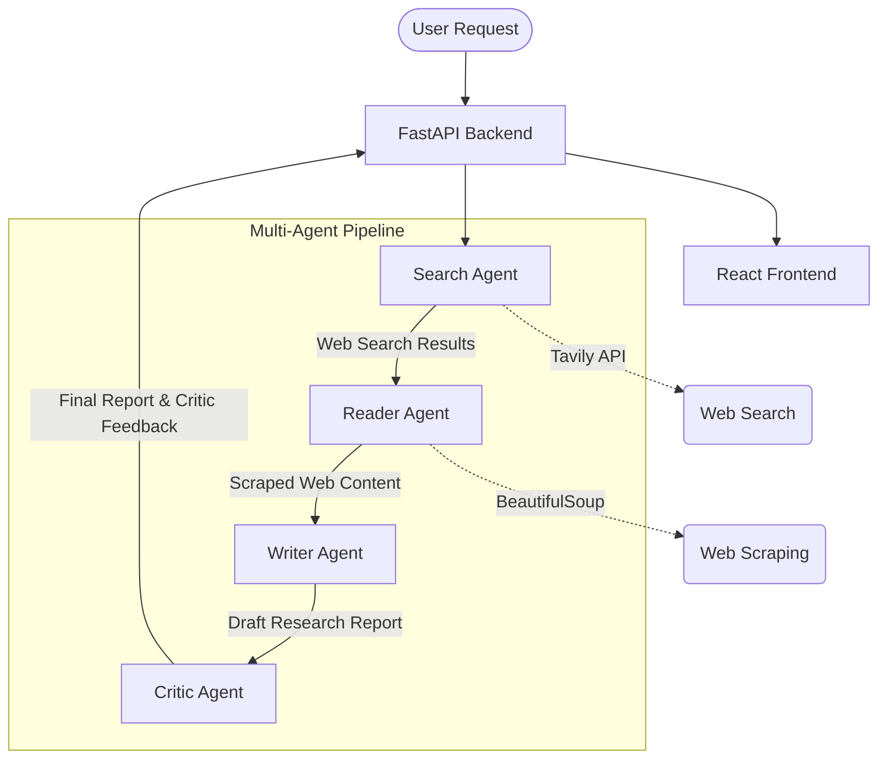

# INQUIRA - Multi-Agent Research System

INQUIRA is a multi-agent AI system designed to autonomously research a given topic by performing web searches, scraping relevant web pages, analyzing the content, drafting a detailed research report, and critically reviewing the findings for factual accuracy and coherence. 

The project features a Python-based FastAPI backend powered by LangChain and multiple LLMs (Groq and Google Gemini), paired with a modern React/Vite frontend.

## 🏗️ System Architecture

The core of the system is a multi-stage AI pipeline where specialized agents sequentially process information to produce a high-quality research report.



### Component Breakdown

1. **Search Agent**:
   - **Model**: Groq (`openai/gpt-oss-20b`)
   - **Role**: Takes the user's research topic and uses the **Tavily API** to conduct a comprehensive web search. It returns the most relevant URLs, titles, and content snippets.
   - **Tool**: `web_search` (TavilyClient)

2. **Reader Agent**:
   - **Model**: Google Gemini (`gemini-2.5-flash`)
   - **Role**: Analyzes the search results to identify the most authoritative and relevant URL. It then scrapes the full text content of that URL for deeper context.
   - **Tool**: `web_scraper` (Requests + BeautifulSoup)

3. **Writer Agent**:
   - **Model**: Google Gemini (`gemini-2.5-flash`)
   - **Role**: Synthesizes the search snippets and the deeply scraped content to write a structured, comprehensive, and professional research report with clear headings and citations.

4. **Critic Agent**:
   - **Model**: Google Gemini (`gemini-2.5-flash`)
   - **Role**: Acts as a fact-checker and reviewer. It evaluates the drafted report for unsupported claims, contradictions, weak sources, and missing information, providing actionable critical feedback.

5. **Backend API** (`api/main.py`):
   - Built with **FastAPI**.
   - Exposes the `/api/research` endpoint to trigger the agent pipeline synchronously and return the final state (including the report and critic feedback) to the client.

6. **Frontend** (`frontend/frontend/`):
   - A modern web interface built with **React**, **Vite**, **Tailwind CSS**, and **TanStack**.
   - Handles user input, displays the research progress, and renders the final markdown report.

## 📂 Project Structure

```
.
├── agents.py             # Defines the LangChain agents and their prompts
├── pipeline.py           # Orchestrates the sequential execution of all agents
├── tool.py               # Defines the custom tools (web_search and web_scraper)
├── pyproject.toml        # Backend Python project configuration
├── requirements.txt      # Python dependencies
├── .env                  # Environment variables (API keys)
├── api/                  # FastAPI Backend application
│   ├── main.py           # API endpoints and server configuration
│   └── schemas.py        # Pydantic models for API request/response validation
└── frontend/             # Frontend React Application
    └── frontend/
        ├── package.json  # Node.js dependencies
        ├── vite.config.ts# Vite configuration
        └── src/          # React components and pages
```

## 🚀 Getting Started

### Prerequisites
- **Python 3.14+**
- **Node.js** (for running the frontend)
- API Keys for:
  - Tavily Search API (`TAVILY_API_KEY`)
  - Groq API (`GROQ_API_KEY`)
  - Google Gemini API (`GOOGLE_API_KEY`)

### 1. Setup Environment Variables
Create a `.env` file in the root directory and add your API keys:
```env
TAVILY_API_KEY="your_tavily_api_key_here"
GROQ_API_KEY="your_groq_api_key_here"
GOOGLE_API_KEY="your_google_api_key_here"
```

### 2. Backend Setup
The backend dependencies are managed via `uv` or `pip`.

```bash
# Create a virtual environment and install dependencies
python -m venv .venv
source .venv/bin/activate  # On Windows use: .venv\Scripts\activate
pip install -r requirements.txt
```

Start the FastAPI server:
```bash
uvicorn api.main:app --reload --host 0.0.0.0 --port 8000
```
*Note: You can also run the pipeline in CLI mode without the server by running `python pipeline.py`.*

### 3. Frontend Setup
Navigate to the frontend directory and install the Node modules.

```bash
cd frontend/frontend
npm install
```

Start the Vite development server:
```bash
npm run dev
```

## 🛠️ Tech Stack
- **AI / LLM Framework**: LangChain, LangGraph
- **LLM Providers**: Groq, Google Generative AI (Gemini)
- **Web Search/Scraping**: Tavily API, BeautifulSoup, Requests
- **Backend API**: FastAPI, Uvicorn, Pydantic
- **Frontend**: React, Vite, Tailwind CSS, Radix UI, TanStack Router
